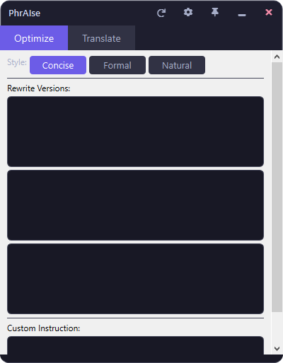
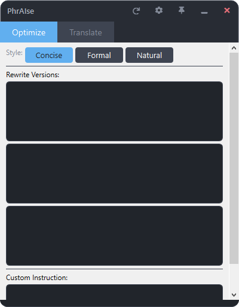
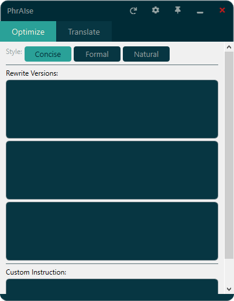
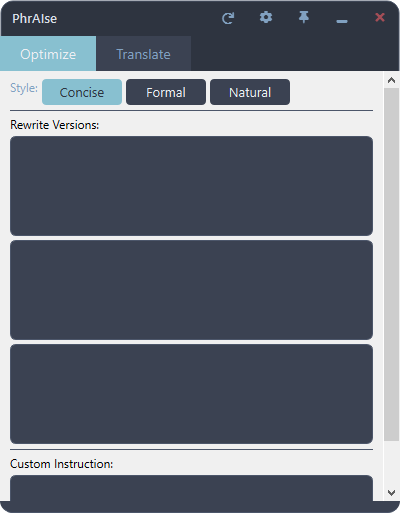
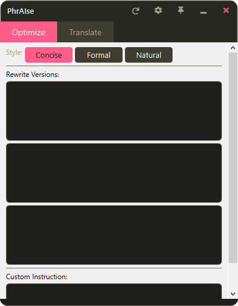
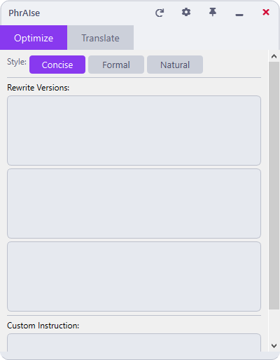
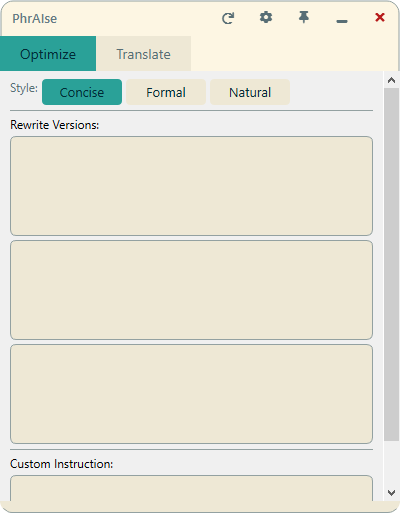
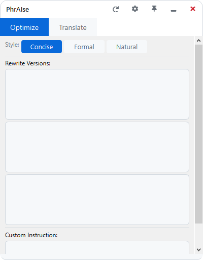
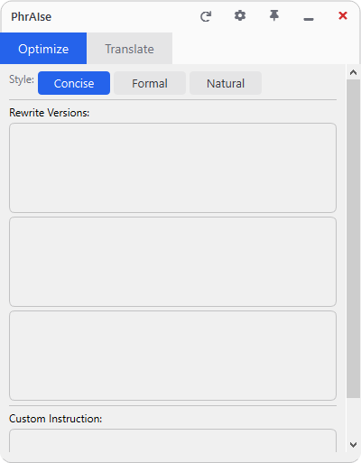

# Custom Theming

PhrAIse ships with nine built-in color themes, from dark palettes like Catppuccin Mocha and Nord Dark to light palettes like GitHub Light and Catppuccin Latte. You can switch between them in the Settings panel, or layer your own CSS on top for finer control. This guide explains both approaches and how to add an entirely new theme palette if you want to customize the source.

## Overview

The theme system lives in [`phraise/theme.py`](phraise/theme.py). It keeps two things separate:

- **Color palettes**: a dictionary of 18 named color keys used to build the application stylesheet.
- **Custom CSS**: a free-form block stored in your settings and appended after the generated stylesheet, so it always wins.

This means you can either pick one of the bundled themes, write a small CSS override, or define a whole new palette by editing a few Python files.

## Selecting a Theme

1. Right-click the floating ball or tray icon and choose **Settings**.
2. Go to the **Appearance** tab.
3. Pick a theme from the **Theme** dropdown.
4. Click **Save**.
5. Restart PhrAIse. The new theme is applied on the next launch.

The selected theme is stored in `%APPDATA%/PhrAIse/settings.json` under `appearance.theme`.

## Built-in Themes

PhrAIse includes five dark themes and four light themes.

### Dark Themes

| Name | Preview |
|------|---------|
| Catppuccin Mocha |  |
| One Dark Pro |  |
| Solarized Dark |  |
| Nord Dark |  |
| Monokai |  |

### Light Themes

| Name | Preview |
|------|---------|
| Catppuccin Latte |  |
| Solarized Light |  |
| GitHub Light |  |
| One Light |  |

## Custom CSS Overrides

The Appearance tab includes a **Custom CSS** editor. Anything you type there is saved to `settings.json` under `appearance.custom_css` and appended to the generated stylesheet by `apply_theme()` in [`phraise/theme.py`](phraise/theme.py). Because it is appended last, your rules override the defaults.

### Editing and previewing

- Type CSS into the editor.
- Click **Validate** to check for bracket balance. A status label shows whether the braces are balanced.
- Click **Preview** to render a small sample frame with your CSS applied.
- Save and restart PhrAIse to see the full effect across the application.

### Example

This snippet rounds all buttons, changes the accent border color, and darkens text edit backgrounds:

```css
QPushButton {
    border-radius: 8px;
}

QComboBox {
    border: 2px solid rgb(108, 92, 231);
}

QTextEdit {
    background: rgb(17, 17, 27);
}
```

You can use hex colors, `rgb()`, or even reference the current theme values by repeating the same colors. The custom CSS block is plain Qt stylesheet syntax, so any valid Qt selector works.

## Creating a New Theme Palette

If you want to add a new theme to the source rather than patch CSS in the UI, create a new palette file and register it.

### 1. Add a palette file

Copy an existing palette from [`phraise/theme_palettes/`](phraise/theme_palettes/), such as [`phraise/theme_palettes/catppuccin_mocha.py`](phraise/theme_palettes/catppuccin_mocha.py), and rename it:

```text
phraise/theme_palettes/my_theme.py
```

### 2. Fill in the 18 mandatory colors

Replace the color values with your own. Every theme must define exactly these keys, which are listed in [`phraise/theme.py`](phraise/theme.py) as `MANDATORY_COLOR_KEYS`:

```python
colors = {
    "bg": "#1e1e2e",
    "bg_darker": "#181825",
    "surface": "#313244",
    "surface_hover": "#45475a",
    "border": "#45475a",
    "ball_border": "#11111b",
    "text": "#cdd6f4",
    "text_muted": "#a6adc8",
    "text_dim": "#6c7086",
    "accent": "#6c5ce7",
    "accent_hover": "#9b8fff",
    "red": "#f38ba8",
    "red_hover": "#f06292",
    "orange": "#fab387",
    "green": "#a6e3a1",
    "yellow": "#f9e2af",
    "white": "#ffffff",
    "grip": "#585b70",
}

theme = {"colors": colors, "sizing": DEFAULT_SIZING}
```

### 3. Register the theme

Open [`phraise/theme.py`](phraise/theme.py) and add an import for your new palette near the top, then add it to the `THEMES` registry:

```python
THEMES: dict[str, FullTheme] = {
    "Catppuccin Mocha": catppuccin_mocha.theme,
    ...
    "My Theme": my_theme.theme,
}
```

### 4. Mark it as dark or light

If your theme is dark, also add the display name to the `_DARK_THEMES` frozenset in [`phraise/theme.py`](phraise/theme.py):

```python
_DARK_THEMES: frozenset[str] = frozenset({
    "Catppuccin Mocha",
    ...
    "My Theme",
})
```

Light themes do not need to be added anywhere besides `THEMES`.

### 5. Restart PhrAIse

The new theme appears in the **Theme** dropdown after a restart.

## Theme Color Reference

The 18 `MANDATORY_COLOR_KEYS` and their roles:

| Key | Role |
|-----|------|
| `bg` | Main application background |
| `bg_darker` | Darker background for inputs and title bars |
| `surface` | Elevated surface background for cards and controls |
| `surface_hover` | Hover state background for interactive surfaces |
| `border` | Default border color for frames and inputs |
| `ball_border` | Border color for the floating ball |
| `text` | Primary text color |
| `text_muted` | Secondary/muted text color |
| `text_dim` | Tertiary/disabled text color |
| `accent` | Primary accent color for active/selected items |
| `accent_hover` | Hover state for accent-colored elements |
| `red` | Error/danger indicator color |
| `red_hover` | Hover state for red/danger elements |
| `orange` | Warning/highlight indicator color |
| `green` | Success/positive indicator color |
| `yellow` | Caution/neutral highlight color |
| `white` | Pure white for high-contrast text on accents |
| `grip` | Drag handle / resize grip color |

## CSS Selector Tips

PhrAIse uses standard Qt stylesheets. These selectors cover the widgets you will most likely want to override:

| Selector | Targets |
|----------|---------|
| `QWidget` | Generic background or font defaults |
| `QPushButton` | Buttons, including primary and sample buttons |
| `QLineEdit` | Single-line text inputs |
| `QTextEdit` | Multi-line text editors, including the custom CSS editor |
| `QComboBox` | Dropdown selectors, such as the theme picker |
| `QComboBox::drop-down` | The dropdown arrow area |
| `QComboBox QAbstractItemView` | The popup list of items |
| `QScrollBar:vertical`, `QScrollBar:horizontal` | Scrollbar tracks and handles |
| `QScrollBar::handle:vertical` | The draggable scrollbar thumb |
| `QTabWidget::pane` | The panel area around tab contents |
| `QTabBar::tab` | Individual tab labels |
| `QFrame` | Framed containers, including the preview frame |
| `QLabel` | Static text labels |
| `QCheckBox` | Checkboxes in settings |
| `QToolTip` | Hover tooltips |

For example, to widen the scrollbar thumb:

```css
QScrollBar::handle:vertical {
    min-height: 40px;
    background: rgb(108, 92, 231);
    border-radius: 4px;
}
```

Or to round the corners of every frame:

```css
QFrame {
    border-radius: 8px;
}
```

Qt stylesheets support most common CSS properties, including `color`, `background`, `border`, `border-radius`, `padding`, `margin`, and `font-size`. If a rule does not seem to apply, try making the selector more specific or adding `!important` sparingly.
